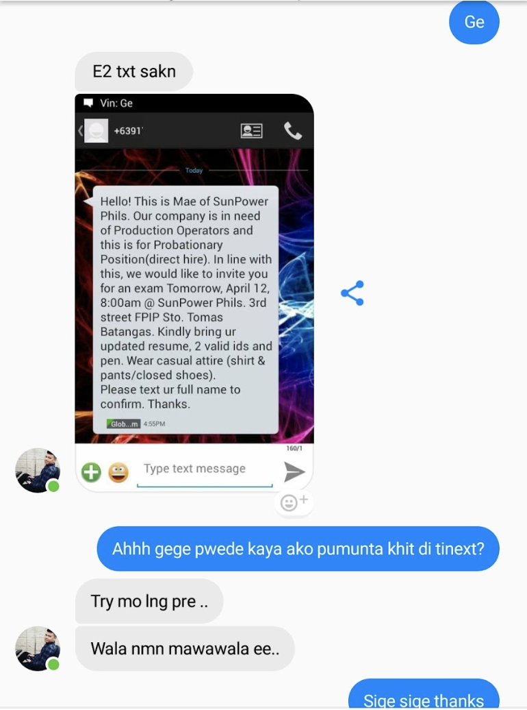

Exactly 6 years ago, I graduated from a state university in Philippines which I took Computer Engineering Technology. Mom asked me if I still want to continue my bachelors degree in Computer Engineering.

>"Of course! It is my dream way back in highschool!"

I really want to know more about computers maybe because I was so fascinated about how this thing works. It feels good to see computers and I even don't mind to be called ***computer addict***. I don't know why but every time I see it, it's fun and makes me feel really excited!

We don't have that much. We were 5 in the family. My 2 sisters were on college that year from different state university, so continuing my bachelors was more like a bad idea due to financial constraints but that idea didn't popped in my head.

Mom asked me if I want to continue in Adamson University.

and I was like, ***"You sure? can you (with dad) do it to send me to such school like Adamson?"***

She said ***"I guess, Yes. we will cope with perseverance. You know us. We'll make a way."***

then I said, ***"As long as you guys can. There's no problem with me, I will finish it."*** Deep inside of me, I am really excited.

So, I went to Adamson. It was a good school by the way. I took the entrance exam, passed it (actually I was surprised that I am allowed to take any courses) transferred my credentials and enrolled.

Few months before I could finish my 1st year in Adamson, I can see and feel the burden of my parents that they were arguing about something. They didn't tell me but I found out that my tuition fees was from a loan with 20% interest.

I feel the burden even they don't know I already knew it. Depression kicks in. You might ask, why not apply for SA or Scholarship? Well I tried but Adamson didn't allowed me to take scholarship program due to some reasons. I forgot maybe due to my previous grades and personally I don't think I can because our house was a 2hr ride (4hrs+ on the road) and head-bursting traffic on a normal day.

I also went to a government agency in Bicutan to enroll as a scholar but they also denied my application  because of my father's ITR.

You might ask, why not a part-time job? Well I tried that too. I gave my resumé to Pizza Hut, McDonalds and several fast foods chains. I didn't received call/message or anything. I went to call centers, practiced my English(sorry about my grammars here) got rejected. Another week another call center, another hell traffic + MRT lines with sardines commute, another hope another prayer but my interviews didn't go well as planned. Going home feels like I just wasted my time, money and hope. When anxiety kicks in. I usually hold the Regret Letter and hoping maybe they will call back. I called it Regret letter because it starts with "Regretfully".

After my last sem in Adamson, I kept on looking for a job. Knowing that I already graduated and earned a technical degree for me I guess that's good enough. In my mind, I need to get out of this debt.

**April 2014**, I woke up early and asked my childhood friend to come with me and spend the day to give away flyers to every company guards in Laguna Technopark. We walked for about 3 hours straight just to give our resumé to each security guards of every companies we passed-by and asked them politely to give it to HR if there's an opening job.

It feels like giving advertisement flyers to someone who doesn't care about what you're doing.

**April 11**, My friend got a message inviting him for an exam. Few hours later, I haven't received any message.

He also asked for an interview from his previous company he was applying for so I asked him if he could forward the message he received and if I could just go instead of him, he said:

>Try it bro, there's nothing to lose.

**April 12, 2014 - Saturday**
( yeah I can still remember). 
I went there with hope but the security didn't allowed me to go through. I gave my ID and he said "Sit there and wait for the call.".

Few minutes later, I realized that I should send a message to the HR and tell what happened. So I texted the number who sent the message to my friend and inform them that I will replace my friend since we were on the same school and eyeing for the same position. So I waited there for 2 hours, praying and focusing and nothing seems to happen. I texted my Mom because she prepared my food before I went out so she knew I was applying for the job.

>"Ma, I'm going home."

I didn't feel anything, I feel the air passing through my chest and I feel completely, nothing.

My mind urges me to stand and walk away. But there's something inside of me saying ***"Stay for a little while and we will go home later."***

Right after I stood...

I heard a name. Security guard called me holding a guest badge with my name on it.

I cannot explain what I was thinking that day but my mind keep on saying thank you thank you... Right from there I thanked the security, grab the badge and went inside in seconds!

Being excited and nervous I can feel my hands shaking and my eyes with tears but I just wiped it and sucked it in. I took the exam and passed it even the HR and technical interviews.

On that day, I can't wait to go home and tell everything to Mom.

...from there, a lot of things happened which I thought would never happen to me and the rest is history.

Paid the loans, gave my parents a vacation trip 2x and contributed for the house renovation. It's almost my 5th year anniversary. I got promoted twice and my manager allowed me to continue my dream coure, BS in Computer Engineering.

I respect all and I am nothing against any beliefs and religions. I just want to share this verse.

***'Trust in the Lord with all your heart and lean not on your own understanding. In all your ways acknowledge Him and He will make straight your paths."*** - Proverbs 3:5-6